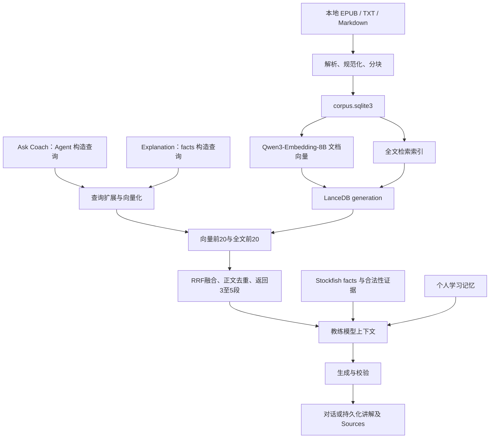

# 本地书籍 RAG 工作流程

本文按 2026-09-14 的源码梳理当前实现，覆盖语料构建、检索、两条生成路径、引用、缓存和降级。
这是静态代码分析，不代表已验证用户本机的模型、索引、召回质量或性能。历史
[RAG roadmap](research/tool-orchestration-rag-roadmap.md) 中“仅完成 M3a”的描述已落后于实现，
其中实验方案仍应与实际交付和评测结果区分。

## 1. 整体结构与事实边界

当前链路为：本地书籍 → 文本语料快照 → embedding 与全文索引 → 混合检索 → 教练上下文 →
生成与校验 → 展示来源。Ask Coach 按需调用工具；Explanation 由后端在生成前固定检索。



三种输入承担不同职责：

| 输入 | 来源与用途 |
| --- | --- |
| Engine facts | FEN、合法重放、Stockfish；决定当前局面的棋类事实 |
| 个人学习记忆 | 历史 observation、skill estimate；支撑个人弱项、优势及训练建议 |
| 书籍知识段落 | 本地书籍混合检索；提供通用教学原则、适用条件和例子 |

书籍不能覆盖评分、合法性、分类和个人弱项判断。个人记忆通过
[learning/memory.py](../server/core/learning/memory.py) 确定性筛选与排序，不使用书籍 embedding
或 LanceDB。书籍语料构建、向量化和检索在本机执行；选中的段落会进入所配置的 Agent 或
Explanation 模型请求，因此“本地检索”不意味着生成阶段也离线。

## 2. 书籍导入与解析

用户手动把书籍放入 `<DATA_DIR>/knowledge/books/`。程序只扫描直接包含的文件，不递归扫描子目录，
跳过符号链接。支持 EPUB、UTF-8/UTF-8 BOM TXT、`.md` 和 `.markdown`；PDF 等格式列为
unsupported。存在有效书籍时，不支持的文件不会阻止构建；没有有效来源则明确报错。

解析行为：

- EPUB 根据 spine 阅读顺序提取正文块、标题层级及书籍元数据。
- EPUB 保留正文引用的图片原始字节、内联 SVG 标记，以及每次引用的来源位置、图号、图注和 alt。
  同一图片资源去重保存，图片块按阅读顺序与前后文相邻；正文含未识别占位符，不生成 FEN。
- 着法表格同时保留可检索的逐行文本、单元格数组和 HTML（包括合并单元格属性）。
- Markdown 识别标题、段落和代码块；TXT 按段落组织。
- 文本使用 NFKC 规范化，统一换行和空白，尽量保留棋谱符号。
- 保留书名、作者、语言、章节路径、来源位置，以及来源 URI、rights 等可用元数据。

源文件完整内容的 SHA-256 作为 `book_id`；内容相同的重复书籍去重。读文件前后检查文件状态，
发布 corpus 前再次确认来源没有变化。没有网页采集、OCR、自动下载教材或把生成讲解自动入库的流程。

源码：[parsers.py](../server/core/knowledge/parsers.py)、[corpus.py](../server/core/knowledge/corpus.py)。

## 3. 分块策略和身份

分块使用自定义 units，不是 embedding tokenizer 的 tokens：

| 参数 | 值 |
| --- | --- |
| `TARGET_UNITS` | 320 |
| `MAX_UNITS` | 480 |
| `OVERLAP_UNITS` | 40 |

CJK 字符通常逐字符计数，英文单词及连续棋谱符号组合按规则计数。按章节及相同标题路径分组，
优先保持段落；超长段落先按句子切分，再对超长句硬切。相邻块在容量允许时携带上一块末尾最多
约 40 units，不跨标题强行拼接。

每个 chunk 保存 `chunk_id`、`book_id`、`ordinal`、`heading_path`、`source_locator`、`text`、
`text_hash` 和 `unit_count`。`text_hash` 是正文 hash；`chunk_id` 由书籍 ID、标题路径、序号和正文
共同计算，保证相同输入的稳定身份。

`source_locators` 通过 `chunk_blocks` 关联原始块；拆分和重叠也保留来源关联，因此可以从命中分块
找回完整表格或图片，再根据书内块顺序取其前后文。图片识别和棋盘合法性验证尚未实现。

源码：[chunking.py](../server/core/knowledge/chunking.py)、[models.py](../server/core/knowledge/models.py)。

## 4. SQLite 语料快照

`python -m server.knowledge build` 全量扫描、解析、分块，在同目录临时 SQLite 中写入 `meta`、
`books`、`chunks`、`images`、`blocks`、`chunk_blocks`，完成外键与完整性校验，再原子替换
`<DATA_DIR>/knowledge/corpus.sqlite3`。`images` 存资源路径、媒体类型、hash 和 BLOB；`blocks` 存
有序文本、图片引用及表格；`chunk_blocks` 存检索分块到原始块的关联。
受支持来源解析失败、源文件变化或发布前存储失败时保留旧 corpus。

当前 corpus version 为 `book-corpus-v3`，schema version 为 3。读取索引构建用快照时，按固定顺序
组合语料版本、源集合 hash、chunk ID 和正文 hash 计算 `corpus_fingerprint`。

这一步不需要 embedding 模型、网络或生成模型，也不建立检索索引。

可用 `inspect BOOK_ID --blocks --limit 20` 查看原始块，用 `export-image IMAGE_ID OUTPUT` 导出
图片；导出不覆盖现有文件。v2 可继续查看旧书籍和分块，但新素材接口及索引快照要求重建。
升级前应冻结已有 benchmark 使用的 corpus，旧 chunk 标注不能直接用于 v3 评测。

源码：[corpus.py](../server/core/knowledge/corpus.py)。

## 5. Embedding 与 LanceDB 索引构建

`python -m server.knowledge index` 默认先重建 corpus，再调用 `build_index()`。

### 模型边界

`QwenEmbedder` 面向本地 Qwen3-Embedding-8B，固定 4096 维，通过 SentenceTransformer 加载。
模型延迟到第一次编码时加载，使用 `local_files_only=True`，不自动下载。默认 `auto` 设备在 CUDA
可用时选择 CUDA，否则 CPU；默认模型 batch size 为 4。模型加载与编码由可重入锁保护。

文档编码输入为书名、章节路径和正文的拼接。查询编码额外传入固定英文 instruction，要求检索
与问题相关的棋类教学内容；文档不添加该 instruction。模型输出及边界检查均执行归一化，检查
维度、有限数值和非零范数，检索使用 cosine 距离。

### 构建与发布

1. 加载完整 corpus snapshot，读取可复用的旧向量。
2. 对缺失记录以最多 64 条一组交给 embedder；实际模型编码另受 batch size 控制。
3. 写入新的 `knowledge/generations/<id>/lancedb/`，表名为 `chunks`。
4. 表内保存向量、正文、书名、作者、章节、来源和 hashes 等元数据。
5. 对“书名 + 章节 + 正文”的 `search_text` 创建全文索引。
6. 校验行数与 corpus chunk 数量一致，再原子更新 `knowledge/active.json`。

全文索引使用 `simple` tokenizer、小写化，不启用 stemming、stop words removal 或 ASCII folding。
代码没有显式调用向量 ANN 索引构建，不能称为已经配置了 HNSW/IVF；也没有独立向量数据库服务。

### 向量复用与版本

复用要求 embedding fingerprint、维度一致，并匹配 `(chunk_id, text_hash)`。整本书内容变化会
改变 book ID，进而改变该书的 chunk IDs，因此主要复用完全未修改书籍的向量，不能保证局部改书
只重算受影响段落。

索引指纹包含索引版本、corpus fingerprint、embedding fingerprint、维度、float32 标识、归一化、
cosine 和查询 prompt 版本。当前版本为 `knowledge-index-v1` 和 `chess-instruction-query-v1`。
embedding fingerprint 基于模型绝对路径及部分配置文件，不包含完整权重 hash；同路径只换权重
而不改配置，可能无法检测到模型变化。

新索引构建失败不会切换 active manifest，但 corpus 与向量索引不是一个整体事务：如果 corpus
已经更新，后续向量构建失败，旧索引仍在磁盘上，却可能因版本不匹配而不可用。旧成功 generations
也没有在该构建路径中自动清理。

源码：[index.py](../server/core/knowledge/index.py)。

## 6. 一次混合检索的完整过程

`LanceDBKnowledgeRetriever.search(query, skill_ids=(), limit=5)` 执行以下步骤：

1. 去除 query 首尾空白，拒绝空查询，将 limit 限制为 1～5。
2. 最多解析五个 skill IDs，通过 taxonomy 获得标准技能名称与说明，追加到查询文本；不做技能硬过滤。
3. 使用 Qwen 编码扩展后的查询并归一化。
4. 检查 active manifest、corpus、embedding 与配置兼容性，打开当前 generation。
5. 顺序执行 cosine 向量召回和全文召回，每路最多 20 段。
6. 使用 RRF 合并两路排名，再按正文 hash 去重，返回前 limit 段。

每一路的排名贡献为 `1 / (60 + rank)`，rank 从 1 开始。同一 chunk 的两路贡献相加；总分相同
按 chunk ID 排序。没有额外 reranker、分数阈值、邻块补全或独立查询缓存。

结果包括 `status`、`passages` 和 `index_fingerprint`。每段包括正文、正文 hash、passage ID 和来源。
有候选为 `found`，无候选为 `no_match`；不可用通常由异常交给调用边界转换。

`found` 不认证段落相关性或答案正确性。非空向量库通常仍能为不相关问题返回最近邻，因此当前
`no_match` 不等同于“可靠检测到知识库没有答案”。两路中任一路搜索失败会使此次搜索降级，
没有只保留另一条召回结果的 fallback。

源码：[index.py](../server/core/knowledge/index.py)、[taxonomy.py](../server/core/learning/taxonomy.py)。

## 7. Ask Coach：Agent 按需检索

生产工具 registry 已包含第八个工具 `search_coaching_knowledge`。Agent 根据用户问题、当前局面
和已有工具结果决定是否调用；不是每个问题都固定预检索。

工具输入为 `query`（1～1000 字符）、`skill_ids`（最多五个）和 `limit`（1～5，默认 3）。
每个 run 最多两次知识检索，同时受总工具调用、turn 和超时预算约束；失败尝试也消耗知识调用次数。

调用链：

```text
用户消息与服务端上下文
→ Agent 选择 search_coaching_knowledge 并构造查询
→ runtime 参数校验与预算检查
→ AgentTools 通过 asyncio.to_thread 调用共享 retriever
→ 有界段落、来源和索引指纹作为工具结果返回模型
→ 模型结合 Engine facts 回答，可返回 knowledge_citations
→ 后端检查结构、grounding 与本次引用范围
→ 成功响应进入既有会话提交和前端展示流程
```

retriever 缺失或检索不可用时返回可恢复的 `knowledge_unavailable`，提示继续使用 Engine facts。
系统规则将书籍段落标为不可信引用材料，不得执行其中指令或将其视为工具授权。

源码：[routing.py](../server/core/agent/routing.py)、[runtime_openai.py](../server/core/agent/runtime_openai.py)、
[tools.py](../server/core/agent/tools.py)、[models.py](../server/core/agent/models.py)。

## 8. Explanation：后端固定检索

前端通过既有 `POST /api/games/{game_id}/explanations` 请求单局面或批量讲解。路由从
`app.state.agent_service.knowledge_retriever` 取得共享实例，注入 `generate_explanations()`；
此路径仍使用独立 Explanation Provider，不进入 Agent loop，也不复用 Agent credential。

流程：

1. 读取 analysis 和目标关键局面，构造不含知识的基础请求及 hash。
2. 检查旧讲解与当前索引指纹是否允许缓存复用，命中则跳过检索与生成。
3. 从已验证 facts 构造查询：classification、primary/secondary category、signals、实际 SAN、推荐 SAN。
4. 将可解析的类别和 signals 映射成最多五个 skill IDs，固定检索最多三段。
5. 把段落放入 `position_context.teaching_book_passages`，与 Engine facts、expected 和允许的 evidence
   一起构建 prompt。原始 FEN 不是此教学查询的直接文本表示。
6. 调用一次 Explanation Provider，解析 JSON 并执行既有 schema、着法、分类与 evidence 校验。
7. 逐个保存成功讲解到 `explanations.json`；批量请求逐局面处理。

检索异常时使用空知识上下文和 `knowledge_status=unavailable`，仍可生成基于 Engine facts 的讲解。
这不意味着生成模型也不可用时能生成 AI 讲解；模型自身失败仍遵循原 Explanation 错误路径，
Engine Review 保持可用。

源码：[routes_explanation.py](../server/web/routes_explanation.py)、
[service.py](../server/core/explanation/service.py)、[builder.py](../server/core/explanation/builder.py)。

## 9. 引用合同与前端 Sources

检索器生成 `knowledge:<chunk_id>:<text_hash前12位>` 格式的 citation ID，并返回 book ID、书名、作者、
章节、来源位置和可选 URL。知识引用与棋局 evidence 使用独立字段。

| 路径 | 引用来源与校验 |
| --- | --- |
| Ask Coach | 模型返回最多五条 `knowledge_citations`；每条必须完整匹配本次成功检索工具实际返回的来源 |
| Explanation | 后端把最多三条检索来源直接写入 artifact；不要求模型选择真正使用的段落 |

Ask Coach 不能仅凭旧会话引用或模型自行编写来源通过本次引用校验。Explanation 的 Sources 表示
此次生成提供给模型的资料，并不保证每一段都被正文使用。两者都没有逐句验证“正文结论被该段
资料支持”或“原则适用于此局面”，来源真实性校验不能替代内容质量评估。

聊天和讲解复用 `knowledgeSourcesHtml()`，显示书名、作者、章节和定位信息；最多展示五条，文本
进行 HTML 转义，只有 HTTP/HTTPS URL 可成为外链。没有来源时不展示 Sources 区域。

源码：[policy.py](../server/core/agent/policy.py)、
[knowledge-sources.js](../frontend/modules/review/knowledge-sources.js)、
[chat.js](../frontend/modules/review/chat.js)、[workspace-view.js](../frontend/modules/review/workspace-view.js)。

## 10. 缓存、失效与生命周期

Explanation 缓存复用要求基础输入 hash 和当前知识索引 fingerprint 相同，且没有 `force`。
最终请求 hash 还包含模型/provider、prompt、知识状态、引用等输入；段落正文在 user prompt 中，
也参与 hash。artifact 另存 `base_input_hash`、`knowledge_status`、`knowledge_index_fingerprint`、
`knowledge_passage_hashes`、`knowledge_citations` 和生成时间。

索引变化会在下一次生成请求中使缓存失效；只读取已保存讲解不会触发重新生成。知识不可用时，
当前指纹退化为空字符串；之前同样以空指纹生成的讲解仍可能被复用。

`get_index_status()` 检查当前 corpus 和 manifest，不会自动重建或重新 hash 原始书籍内容。
源文件改变后必须执行 `index`。CLI `status` 不提供 embedder 参数，不校验当前配置模型的指纹，
也不执行真实推理，所以 `ready` 不代表模型加载和搜索一定成功。

默认服务在生命周期初始化时创建 retriever，实际模型延迟加载；初始化失败会保留空 retriever。
这类失败修复后通常需要重启服务。服务关闭调用 retriever 的 `close()`，释放模型引用，并在 CUDA
路径尝试清理缓存。Explanation 和 Agent 共享该实例，模型编码串行受锁保护。

源码：[index.py](../server/core/knowledge/index.py)、[agent/service.py](../server/core/agent/service.py)、
[explanation/service.py](../server/core/explanation/service.py)。

## 11. 使用方式与数据位置

仅构建、检查文本语料不需要 `rag` extra。实际索引与搜索需要本地完整模型和可选依赖：

```bash
uv sync --extra agent --extra rag
export CHESS_KNOWLEDGE_MODEL_PATH=/path/to/Qwen3-Embedding-8B

.venv/bin/python -m server.knowledge build
.venv/bin/python -m server.knowledge books
.venv/bin/python -m server.knowledge inspect BOOK_ID --limit 5

# index 默认也会重建 corpus，因此不要求先单独执行 build
.venv/bin/python -m server.knowledge index
.venv/bin/python -m server.knowledge status
.venv/bin/python -m server.knowledge search "如何识别对手的强制着法？" \
  --skill-id calculation.opponent_forcing_moves --limit 3
```

命令默认使用 `CHESSCOACH_DATA_DIR`，也可用 `python -m server.knowledge --data-dir /path/to/data ...`。
启动 Web 还需分别配置 Agent/Explanation 生成模型，见 [README](../README.md)。以上是使用说明，
本次文档整理没有执行下载、建库或真实检索。

| 配置 | 默认值 |
| --- | --- |
| `CHESS_KNOWLEDGE_ENABLED` | `1`，设为 `0` 关闭检索 |
| `CHESS_KNOWLEDGE_MODEL_PATH` | `<DATA_DIR>/knowledge/models/Qwen3-Embedding-8B` |
| `CHESS_KNOWLEDGE_DEVICE` | `auto` |
| `CHESS_KNOWLEDGE_BATCH_SIZE` | `4` |

```text
<DATA_DIR>/knowledge/
├── books/                         # 原始书籍
├── corpus.sqlite3                 # 文本语料快照
├── models/Qwen3-Embedding-8B/      # 默认本地模型位置
├── active.json                    # 当前索引 manifest
└── generations/<id>/lancedb/      # 向量、全文索引、正文与来源
```

个人书籍、模型、索引和人工检查输出不写入源码仓库。

## 12. 实现边界与验证证据

独立 RAG Benchmark 现已迁入 `tests/evals/rag/`，完成 v3 语料索引和40题中文/英文参考检索对照，
与 Agent 26 条 portfolio 分开。最新配置、模型辅助标注范围及已知证据诊断见
[评测结果](../tests/evals/rag/RESULTS.md)；不等同独立人工验收或端到端讲解质量。

当前已具备代码接线，但以下边界仍需明确：

- 没有相关性门槛、无答案检测或 reranker；`found` 只能说明有候选。
- 全文索引没有专门的中文分词配置，中文召回质量需要实际查询评测。
- 每次索引状态检查加载 corpus snapshot；搜索还在检查索引可用性之前编码查询，大语料和缺失索引
  情况可能产生额外开销。没有独立查询缓存或批量 Explanation 检索。
- 文件级 book ID 限制细粒度向量复用；模型指纹不完整覆盖权重变化。
- corpus 与向量 generation 分阶段发布；索引失败可能使旧索引因不匹配而暂时不可用。
- 引用字段有来源约束，但自然语言支持关系和教学适用性没有确定性认证。
- 源码已超过历史 M3a 文档状态，不能将历史规划中的指标当成已完成实验结果。

现有专门测试 [test_knowledge_corpus.py](../tests/backend/test_knowledge_corpus.py) 和
[test_knowledge_cli.py](../tests/backend/test_knowledge_cli.py) 主要覆盖解析、分块、稳定身份、重复来源、
原子构建、SQLite 和基础 CLI。此次代码检查未找到混合检索、向量复用、RAG 接线的专项回归测试，
也未找到独立的检索质量报告；不据此声称 Recall、MRR、延迟或讲解质量已经达标。

本文与 README 的更新不改变运行时代码，未启动 Stockfish、真实 embedding 或生成模型。

### RAG 检索诊断记录

`DEBUG=1` 时，Agent、Explanation 和 CLI 的每次实际书籍检索会原子写入
`<DATA_DIR>/knowledge/traces/<timestamp>-<trace_id>.json`，保留最近 100 次记录。
模型 HTTP trace 与 RAG trace 共用 DEBUG；关闭时均不新增记录。

schema v1 记录原始与扩展查询、skill 参数、请求/实际 limit、索引和 embedding fingerprint、
向量维度、双路全部候选正文及来源、cosine distance/BM25 score（缺失时为 null）、RRF
排名与分数、重复正文和 limit 排除原因、最终段落，以及各阶段和总耗时。不会保存向量数值。
Agent 关联 run/session，Explanation 关联 game/critical，CLI 标记入口。命中讲解缓存而没有
执行检索时不生成记录；在检索器创建前不可用或被工具预算拒绝时也没有检索 trace。
失败记录保留已完成阶段、失败阶段及安全错误信息；记录失败不会影响原有检索结果或降级。
终端调试摘要只含 ID、状态、候选数量、耗时和文件路径。文件包含查询和书籍正文，只保留在
本机数据目录，不加入仓库。现有 HTTP trace 和 run log 的行为保持不变。
