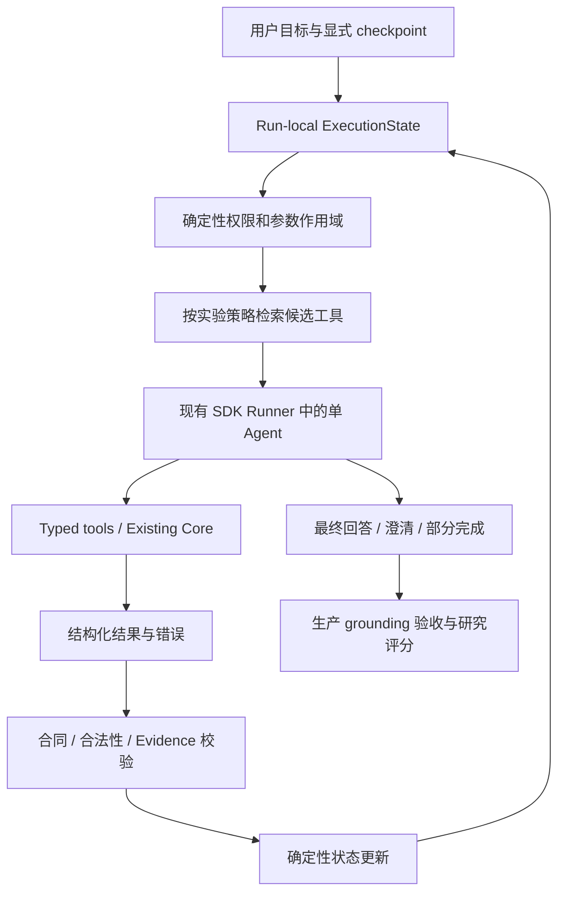

# Execution-Aware Tool Orchestration：研究分析与实施计划

**日期：** 2026-09-08

**状态：** Proposed；本文件是研究计划，尚未实施或取得实验结果

**主交付：** P0–P2，单 Agent 的动态工具检索与执行状态对照实验

**条件扩展：** P3，Selective Delegation；模型训练另行立项

**分期边界：** P0 验证实验设施；P1 建立静态基线；P2 逐个加入动态方法。
具体实施见 [P0 实施计划](execution-aware-tool-orchestration-p0-implementation-plan.md)。

**项目基线：** [README](../../README.md)、[Agent 共享设计](../requirements/agent/README.md)、
[现有 Eval](../../tests/evals/README.md)

## 1. 判断与范围

建议采用这个方向。ChessCoach 的价值在于具有真实业务依赖、昂贵的 Engine 调用、明确的错误
反馈和可验证的事实，可以研究执行过程中下一步工具需求如何变化。首要目标是得到可信的
方法比较和可复用实验环境，并在证据支持时把有效策略接入产品。

研究问题定义为：

> 在相同工具权限、模型和资源约束下，用已验证的执行结果更新候选工具集合，能否改善
> ChessCoach 多步任务的完成率、错误恢复和成本？收益在哪些任务与工具规模上出现或消失？

以下假设必须通过实验检验，不能预先当作结论：

- 扩大工具集合是否降低 Full Context 的表现；7–30 个工具也可能始终处于模型的舒适区。
- Execution-aware 是否优于 query-only、plan-aware 和现有人工策略；状态噪声也可能降低效果。
- 多 Agent 是否有独立于工具并发、额外 token 和更强模型的收益。

P0–P2 不要求新增模型训练、Vector DB、第二套 Agent runtime、网络知识工具或多 Agent。
动态编排首先复用现有工具。P3 不作为 P2 完成标准，也不默认进入生产。

研究计划不覆盖既有 V1 决策。生产行为改变前，应同步对应需求、policy/schema 版本、消费者、
回归测试和模型 benchmark；新增 specialist 时应更新
[ADR-003](../adr/ADR-003-single-agent-first.md)。

## 2. 对原建议的修正

| 原建议中的判断 | 分析与计划调整 |
| --- | --- |
| 当前系统是 query → select tool | 当前 `allowed_tools_for(message, context)` 已使用初始局面、已有 facts 和个性化开关。准确基线是“基于 query＋初始 checkpoint 的规则暴露，run 内集合固定”。 |
| 下一步需求变化就是 distribution shift | 首先称为“状态条件下的工具需求变化”。只有明确训练/测试分布并测量差异后，才讨论 distribution shift。 |
| 先证明 Full Context 恶化，再证明动态检索有效 | 改为检验假设；允许负结果。不按测试结果反复改工具名称或任务来制造预期曲线。 |
| 把工具扩展到 20–30 个 | 原生 7 工具足以研究依赖和恢复。真实扩容、语义干扰压力测试和外部大规模检索基准分别报告。 |
| Stockfish 是所有结果的 ground truth | FEN/合法性可严格检查；Engine 评价依赖版本、配置与搜索预算；讲解是否有教学价值仍需独立评价。 |
| Planning＋Routing＋Execution＋Grounding 是失败分解公式 | 作为诊断标签，而非可直接相加的互斥事件。记录首个失败及后续影响，允许多标签和无法判定。 |
| SQLite session 可直接存 ExecutionState | 会话连续性与 run 内执行状态生命周期不同。先使用 run-local 状态；不把模型计划升级为持久化棋类事实。 |
| P0 记录完整 query、参数和 observation | 在隔离 fixture 研究运行中记录可回放的结构化事件；生产 `runs.jsonl` 保持现有去敏合同，不保存完整 prompt、FEN、PV 或 reasoning。 |

## 3. 论文核验与复现定位

本次核对了下列官方论文页面；主线论文同时阅读方法和实验部分。没有运行作者代码，也没有
验证其报告数值能否复现。以下“项目采用”均为迁移方案，不代表原论文已在 ChessCoach 验证。

| 工作与来源 | 原文机制、关键证据和边界 | 项目采用方式 |
| --- | --- | --- |
| [DTDR：Dynamic Tool Dependency Retrieval for Lightweight Function Calling](https://aclanthology.org/2026.findings-acl.1680/)，Findings ACL 2026 | §3 明确主要设置在不交错执行函数的情况下逐步生成计划。Figure 2 / §4 用 query＋调用名称历史建模依赖：DTDR-C 使用聚类与依赖图，DTDR-L 使用线性分类器。不是简单拼接 query＋subgoal，也不能直接证明实际 observation 的收益。 | 最接近的主参考。增加 history/dependency-aware 对照；第一轮使用固定 embedding，无参数训练，复现 DTDR-C 的核心依赖机制需单独核对图构建、平滑和回退。 |
| [ToolScope](https://aclanthology.org/2026.acl-long.1573/)，ACL 2026 | Figure 2 / §3 包含工具合并、自动纠正以及混合检索和重排。Table 2 比较组合方法的选择表现；合并还改变工具及标签空间，不能把所有收益归因于检索。 | 借鉴相似工具实验；增加人工 canonicalization 对照。不能只扩增别名，然后把合并它们当成新能力。 |
| [ToolQP：Beyond Single-Shot: Multi-step Tool Retrieval via Query Planning](https://arxiv.org/html/2601.07782v1)，2026-01 预印本版本 | Figure 1 / §3 的 observation 是检索器反馈，规划器逐步生成查询并汇总工具。Table 1 是 ToolRet 检索对比。完整方法包含合成轨迹训练与 RLVR，不等于无训练的 plan-aware embedding。 | 借鉴查询分解；无训练版本标为 ToolQP-inspired，不标为完整复现。检索反馈与业务工具执行结果分开。 |
| [ToolRet：Retrieval Models Aren’t Tool-Savvy](https://aclanthology.org/2025.findings-acl.1258/)，Findings ACL 2025 | 官方页面报告约 7.6k 检索任务、43k 工具，研究通用 IR 到工具检索的迁移。它是 2025 工作；静态检索数据不能自动变成可执行的动态环境。 | 可选外部检索验证；单独报告检索指标，不把工具描述当作可调用实现。 |
| [ToolOmni](https://aclanthology.org/2026.acl-long.1736/)，ACL 2026 | §3 用 SFT 与 Decoupled Multi-Objective GRPO 联合优化检索、执行。Table 4 / Figure 5 做训练和奖励消融；§4.1 的端到端部分使用模型 judge，训练配置含 8 张 H100。 | 作为后续训练路线。P0–P2 的无训练实验不能声称复现其训练结论；grounded execution 一词不意味着完全确定性评分。 |
| [Uno-Orchestra](https://arxiv.org/html/2605.05007v1)，2026-05 预印本 | Figure 2 / §4 联合决定拆分及 model–primitive 配对，并用 SFT、Agentic-GRPO 学习预算下的选择性委派。 | P3 借鉴是否委派的决策问题；规则或 prompting router 属于机制借鉴。 |
| [ClawArena-Team](https://arxiv.org/html/2606.31174v1)，2026-06 预印本 | §3 固定 worker pool 来比较 manager；Table 2 部分约束刻意要求委派、多模态和并发，适合测试管理能力。 | 借鉴固定 worker 和管理过程指标；不能用强制委派的场景证明自然任务“需要多 Agent”。 |

原建议开头说明 DTDR 时链接到了 ToolScope，以上已改为对应来源。阅读次序建议为
DTDR → ToolScope → ToolQP → ToolOmni；P3 启动时再精读 Uno-Orchestra 和 ClawArena-Team。

复现分三级标记：**原设置复现**需要作者模型、数据、实现与评分协议；**核心机制复现**保留关键
算法但更换领域；**方法借鉴**只保留思想。每份报告必须写明属于哪一级及偏离项。

## 4. 当前代码与真实能力

| 当前工具 | 已有能力与边界 |
| --- | --- |
| `get_review_context` | 读取当前会话明确选中的已存关键局面及 Engine facts；不是任意棋局加载器。 |
| `analyze_position` | 对当前 FEN 做受限分析；已有 `purpose` 覆盖候选比较、最佳着和局面解释，不应直接拆成三个近义工具。 |
| `analyze_move` | 分析当前局面的一个合法 what-if 着法，优先复用 artifact。 |
| `lookup_opening` | 本地 ECO/名称元数据；没有在线开局理论检索。 |
| `get_player_profile` | 返回有证据的学习画像；受个性化开关控制。 |
| `get_training_candidates` | 读取训练候选及合法 reference，不用候选数量证明长期弱点。 |
| `create_training_draft` | 创建供后续业务流程验证的草案；不是任意永久写工具。 |

相关落点：

- [models.py](../../server/core/agent/models.py)：7 工具名称、READ/COMPUTE 权限、DTO 和响应合同。
- [policy.py](../../server/core/agent/policy.py)：初始工具暴露、grounding 和 run 结果验收。
- [runtime_openai.py](../../server/core/agent/runtime_openai.py)：SDK 工具装配、调用预算、参数边界和 telemetry。
- [tools.py](../../server/core/agent/tools.py)：适配既有 Core、artifact 和实际 Engine 使用计数。
- [agent_runs.py](../../server/core/storage/agent_runs.py)：有界去敏日志。
- [tests/evals](../../tests/evals/README.md)：26 baseline＋11 hardening；fake、live 与系统测试证据不同。

默认 run 上限为 4 turns、6 次总工具调用、2 次 Engine 调用、120 秒。研究须同时记录逻辑工具
调用与实际 Engine 调用：cache hit 和复合能力不能按工具名称粗略计费。

`load_game`、`detect_critical_positions`、`classify_motif` 等示例不是现有 Agent 工具。
P0 的棋局/局面由 fixture checkpoint 明确提供；缺失或含糊的位置进入澄清/降级，不允许模型
自行猜 FEN。跨多个任意位置的任务需要新的 scoped reference 合同，不能默认已有权限。

## 5. 研究问题与实验主张

| 编号 | 假设 | 主要检验 |
| --- | --- | --- |
| RQ1 | 当同一 query 和调用前缀产生不同结果时，执行状态能改善下一步候选覆盖及决策。 | 固定状态回放中 D 对 C/H 的配对差异，以及端到端多步成功率。 |
| RQ2 | 动态检索的收益受工具数量、描述相似度和任务依赖深度影响。 | 分别控制工具规模与重叠程度；报告原生工具和压力工具结果。 |
| RQ3 | 执行状态能改善恢复、去重及停止行为，并在计入检索/规划开销后仍有价值。 | 可恢复故障、已有足够证据、预算不足切片的正确行为与成本。 |
| RQ4（P3） | 选择性委派在部分可分解任务上优于单 Agent 与固定委派。 | 固定模型/worker、全局预算下，与普通工具并发比较。 |

“增加 observation 字段”不作为创新声明。可交付价值是：领域迁移、可验证数据与错误分析、
严格对照、成功与失败边界。结果为零增益或负增益也完成研究问题，不以曲线方向作为验收条件。

## 6. 设计：权限、检索、执行与状态分层



### 6.1 候选集合不能代替权限

区分授权集合 `P_t`、检索候选 `C_t` 和最终调用。所有研究方法共享同一 `P_t`：由用户授权、
个性化开关、checkpoint 归属、参数作用域和预算确定，不能来自相似度分数或模型计划。
检索只在其中排序；执行前再次验证权限、实际参数及 generation。

当前 `allowed_tools_for` 混合了权限、可用性与任务相关性。P0 保留原实现作为 R0 基线；
为研究方法抽出共享的确定性授权检查，不能把当前 query 规则的窄集合当作全部方法的检索上界。
“这个工具看起来不相关”与“没有权限调用这个工具”必须分开。

各方法共享必要的参数前置条件检查；不要在执行状态版本之外偷偷加入“oracle 下一步”过滤。
如按实际前置条件缩小候选域，必须对 A/B/C/D 一致应用并记录过滤原因，另做过滤开关消融。

### 6.2 ExecutionState 合同草案

以下为待实现的内部 DTO 设计，不是现有持久化 schema，也不直接对前端暴露。

| 字段组 | 建议内容 | 所有者 |
| --- | --- | --- |
| 身份 | `schema_version`, `run_id`, `session_id`, `generation`, `state_revision` | 后端 |
| 目标与计划 | `user_goal`, `plan_revision`, `current_subgoal`, `pending_steps`，含 step ID 和依赖 | 模型可提议；后端检查结构、数量、授权和引用 |
| 已执行步骤 | tool/call ID、参数 fingerprint、状态、产物 reference、顺序 | 由实际事件生成，模型不能自行宣称完成 |
| 证据 | 已验证 facts/reference、来源、局面 identity、Engine provenance | Core / 校验器 |
| 待补信息 | 有类型的缺项，例如 position、profile evidence、candidate reference | 合同检查；模型建议另存为未验证字段 |
| observations | 工具 envelope、错误码、evidence refs 的有界投影与事件引用 | 工具 adapter / 校验器 |
| 恢复状态 | 失败调用与参数 fingerprint、错误分类、替代尝试次数、无进展次数 | 后端 |
| 资源 | total/Engine 调用余额、deadline、已用 token 与下一请求输出上限 | 共享预算账本 |

状态更新原则：

1. 计划是待执行意图；只有成功且通过合同校验的结果才能增加 facts 或 completed steps。
2. 错误能更新恢复状态，不能生成虚构产物；storage consistency error 按现有失败语义处理。
3. 同一 FEN 的“合法”“已分析”“证据足够”是不同状态，不能压缩成一个布尔值。
4. token usage 可能在响应后才返回；输入估算、输出上限和事后核算分别记录，不声称能精确
   预扣不可观察的 token。未知 usage 为 null，不记零成本。
5. 状态先保存在 `_LocalRunContext` 所属 run 中。SQLite 继续管理 conversation，summary
   不能恢复为棋类事实；上下文 generation 变化即取消旧状态并阻止提交。
6. observation 用 schema 字段构建有界摘要，避免默认增加一个负责总结状态的 LLM，从而
   混入额外模型计算的收益。使用 LLM 摘要时作为独立变体并计费。

### 6.3 SDK 接线与重复调用

本地锁定 `openai-agents==0.22.0` 源码已确认存在 `FunctionTool.is_enabled` 的动态回调，
`Agent.get_all_tools` 会评估该回调，run loop 会重新获取工具。可优先利用这个公开接口，
在现有 adapter 内基于 run-local 状态刷新候选，而不增加手写 Responses tool loop。

这是静态源码可行性检查，仍需 P0 fake-model spike 验证：每轮实际发出的 schemas 是否更新，
旧调用记录是否可继续解析，取消/错误后是否泄漏候选，以及输出验收是否仍走生产路径。
不得导入 SDK `run_internal` 作为产品依赖。

回调可能并发、重复执行：候选检索按 state revision 单次计算/缓存，同轮所有工具共享不可变
candidate snapshot；执行校验读取本轮 snapshot，不能让每个 `is_enabled` 独立触发 embedding
或 LLM 规划。第一轮串行调用，独立工具并发列为后续消融；同批调用完成后统一归并状态。

动态集合验收不能只检查 `request.allowed_tools`：需同时保留本次 run 授权范围和每次决策的
候选 snapshot，以校验实际调用在当时是否可用。变更生产路径时更新对应合同及 policy 版本。

历史保留真实工具调用与结果，但不额外把所有旧 schemas 反复注入 prompt。模型可能从历史
记得工具名，这属于真实条件；记录累计见过的工具数，不能声称 Top-K 完全抹去了历史暴露。

候选为空、工具失败或没有进展时，使用显式澄清/部分完成，或预算内一次扩大候选的替代尝试。
扩大范围不越过权限，所有方法采用相同回退协议，同时报告首次检索与回退后的结果。

## 7. 工具集合：原生能力与压力条件

### 7.1 原生主实验

首先使用真实 7 工具。语义检索索引包含工具名、完整参数含义、用途、前置条件、产物类型与
成本类别，尤其包含 `analyze_position.purpose` 的区分。冻结 registry/schema/description 版本。

可检索 capability 可以映射到一个 tool 的不同合法参数用途，但必须区分：
**capability 数、暴露的 tool schema 数、实际独立执行能力数**。只有增加真实 callable schema
时才计入工具数量；参数枚举不能直接宣传成多个新工具。

### 7.2 扩容准入

真实新工具必须同时满足：稳定的 Core 能力、不同输入/产物合同、实际用户任务、必要的权限
边界、可测试的成功和失败语义。优先调查以下能力，不承诺全部实现或凑到 30 个：

| 候选能力 | 可能复用的边界 | 实现前需要确认 |
| --- | --- | --- |
| 搜索已导入棋局、读取棋局元数据 | history / storage | 查询范围、显式 game reference、返回上限。 |
| 读取合法重放后的着法时间线 | game artifact / chess replay | 与当前 checkpoint 的关系及跨位置作用域。 |
| 列出已分析关键局面 | analysis artifact / prioritization | 与 `get_review_context` 的列表/详情合同区分，不重跑分析。 |
| 读取某时间窗口训练记录 | learning / history | 与 profile 聚合的区别，最小化个人数据。 |
| 检索现有精选 puzzle | 已有 puzzle/training Core | 数据来源、主题合同、是否被现有候选工具完整覆盖。 |

没有可靠知识库就不增加 opening theory 工具；没有确定性事实提取能力就不增加让 LLM
“识别战术事实”的工具。不得为了名称差异重复实现评分、分类、排名或训练逻辑。

### 7.3 7 / 15 / 30 压力实验

若真实独立能力不足，则在 `tests/evals` 的实验 registry 中加入固定的干扰项与等价别名，
明确标为 synthetic stress，不进入生产工具清单。可执行压力轨道的每个工具须有真实 adapter
或可验证的 fixture executor；仅有描述的数据只参与检索轨道。

固定同一批由原生能力即可解决的任务，在嵌套工具集合上比较。无关但可执行工具与相似工具
分别成组，数量、描述长度、顺序 seed、等价类映射写入 manifest。增加工具数时不得同时
更换任务难度或增加必须使用的新能力。

对别名同时报告 exact-tool 与 canonical-capability 评分；参数和效果都等价的路线不能判错。
加入 canonicalization 基线：如果去重已解决问题，报告该结论。需要主张大规模检索能力时，
另跑 ToolRet 等外部检索任务；30 工具压力测试不等于开放世界工具使用验证。

## 8. 方法与公平对照

令 `q` 为用户问题，`h_t` 为已观察到的调用名称前缀，`p_t` 为计划子目标，`s_t/o_t` 为
已验证状态/执行结果；`P_t` 为共同授权集合。检索方法输出 `C_t ⊆ P_t`。

| ID | 方法 | 检索器可见信息 / 候选方式 |
| --- | --- | --- |
| R0 | Current Policy | 当前 `allowed_tools_for` 与原 runtime，保留真实产品基线。 |
| A | Full Tool Context | 每轮暴露完整 `P_t`，不是绕过权限暴露全仓库能力。 |
| B | Query-only | 只用 `q` 计算一次全库排名，后续在共同 `P_t` 中取 Top-K；不依赖 observation 重排。 |
| B0 | Query＋Initial Context | 使用 query＋初始 checkpoint 的冻结排名，控制已有上下文带来的增量。 |
| C | Plan-aware | `q + p_t`；主消融中 planner 只看 q、初始上下文及调用名称前缀，不看返回内容。 |
| H | History/Dependency-aware | `q + h_t`；先做相同检索器拼接对照，再在有训练轨迹后复现 DTDR-C 核心机制。 |
| D | Execution-aware | C 的相同计划生成方式，加有界 `s_t/o_t`，每个已提交结果后更新候选。 |
| O | Oracle Candidate | 仅用于诊断：向模型提供合法下一步集合，估计检索瓶颈；绝不混入正式方法或线上状态。 |

第一轮 A/B/C/D 使用相同工具描述、embedding 模型、相似度与 executor。BM25/词法检索作为
廉价 sanity baseline。小 registry 可内存向量检索；embedding 模型固定版本，可选择本地运行，
首次下载资源另计准备成本，不引入外部向量数据库。离线合同测试使用 fake retriever。

候选 K 先在开发集比较 `{2, 3, 5}`，主实验冻结一个 K；A 作为不截断参考。报告 K、实际
候选数和 schema token 数，不能用相同 K 代替相同上下文成本。

固定状态回放时 C/D 复用同一个已生成 plan，隔离 observation 的增量；端到端时两者使用
同一 planner 配置，但按各自轨迹演进。另设 `C+observation-in-plan` 变体：如果 planner 已看
过真实结果，必须标明，不能再将其称为没有 execution information 的对照。

所有下游执行 Agent 都能看到相同规则下的实际工具结果。对 B/C 屏蔽的是**检索器输入**，
不能通过删除其 executor 观察历史来人为削弱基线。A/B 不需要额外生成无用 plan；完整产品
成本如实计入 C/D/H 的额外工作，配对路由实验另隔离这种计算差异。

## 9. 数据、任务与可验证评分

### 9.1 数据分层

1. **现有回归 benchmark**：原 26＋11 case、ID 和 scorer 保留，不作为新方法调参和泛化结论的全部依据。
2. **状态回放集**：给每个方法完全相同的 query、前缀和当前观察，比较候选与下一步决策。
3. **端到端任务集**：方法自行执行、形成轨迹；衡量错误累积与最终行为。
4. **真实 Engine 系统集**：短 PGN/FEN、固定版本和低深度，验证真实接线；不与 fixture 计时混合。
5. **外部检索集（可选）**：验证工具规模迁移，单独报告，不执行未知远程工具。

P0 建立 24 个开发任务，覆盖下表每类 4 个。扩展目标是约 120 个任务，建议 40 开发、
20 验证、60 冻结测试；这是工作量预算，不代表统计功效已足够。先用开发集估计方差和最小
可检测效果，再冻结测试规模与预算。研究集不使用真实个人数据；PGN 使用人工短局或许可明确
的公开来源，记录来源和去重策略。

按源棋局、近重复局面及问题模板家族分组，组间划分；同 query 不同 observation 的配对实例
必须留在同一 split。依赖图、描述调优、阈值选择只使用开发/验证数据，不能读测试标签。

| 切片 | 例子及可观察分支 |
| --- | --- |
| 无需工具 / 已有证据 | 普通知识问题；已加载 facts 足以解释的着法。正确行为可能是直接回答。 |
| 顺序依赖 | 从 profile 的真实 skill reference 获取候选，再产生有来源的 training draft。 |
| 参数依赖与位置绑定 | 比较一个明确 what-if 着法；合法与非法输入要求不同结果，不能擅自切换 FEN。 |
| 结果改变后续需求 | 同 query/调用前缀下，profile 证据充分或不足、候选有结果或为空；下一步或表述约束不同。 |
| 恢复与预算 | 可恢复 Engine 失败、cache hit/miss、预算耗尽；要求可用替代路径或明确部分完成。 |
| 陈旧、取消与不一致 | generation 改变、候选失效、storage consistency error；正确终止与不提交旧结果。 |

主因果证据来自配对实例：保持 query 与调用前缀不变，只改变符合领域合同的返回状态。
正确下一步必须确实发生变化；若只是生成文字不同，则标为 grounding/response 分支，不冒充
routing 分支。标注工具名之外，还需标注合法参数范围和可支持的事实。

### 9.2 可接受路线与 oracle 边界

标注依赖 DAG、各状态可接受的下一动作集合、参数约束、目标产物和终止条件，不限定唯一
工具序列。覆盖合法的并行顺序、artifact 复用、等价工具、提前完成和澄清。

状态投影器只能读取当前 checkpoint 和已发生的事件，不能读 `expected_next_tools`、未来
observation、隐藏最终答案、测试 task 标签或 scorer 结果。Oracle 只在评测进程中生成。
初始缺失信息字段也不能直接抄写数据集的 gold plan。

### 9.3 指标定义

设 `A_t` 为状态 t 的可接受下一工具集合，`C_t` 为检索候选，所有等价映射版本固定。

| 维度 | 指标与分母 |
| --- | --- |
| 检索 | `Recall@K = count(C_t ∩ A_t) / count(A_t)`，`Precision@K = count(C_t ∩ A_t) / count(C_t)`；仅对需要工具且 `A_t` 非空的状态计算。空候选 recall/precision 计 0，并单独报告空集率。 |
| 检索可用性 | `AnyValid@K = 1[C_t ∩ A_t ≠ ∅]`；当 A_t 有多种替代工具时比要求全部召回更直接。另报告 gold 工具全部被授权集合排除的 policy-blocked 状态。 |
| 工具选择 | 下一工具在 A_t 中的比例；`SelectionGivenRecall` 仅在候选覆盖可接受工具时计算，定位 retriever 与 selector 问题。 |
| 无效调用 | 分别报告未知工具、未授权/不在本轮候选、参数无效、合法性/前置条件失败率，分母为全部尝试调用，含被拦截调用。 |
| 任务 | 全部任务中的完整成功率；必须有正确产物与事实验收，不能直接相信模型自报 full。预期澄清、部分完成、取消另报 protocol correctness。 |
| 轨迹 | 无新增有效证据或进展的冗余调用、实际调用数、no-progress 次数；StepsToSuccess 同时报成功条件分布和失败/超时数，避免幸存者偏差。 |
| 恢复 | 在预先定义的可恢复注入故障任务中，按要求恢复的比例；不可恢复错误的正确降级单列。 |
| Grounding | 提交前无依据声明尝试、被校验器拦截比例、最终通过率分别报告，防止用丢弃错误输出获得虚假的 100%。 |
| 成本 | 全链路 input/output/cached tokens、请求数、embedding/规划/重排耗时、逻辑工具与实际 Engine 调用数；缺失 usage 单列。 |
| 延迟 | 所有运行的 p50/p95、超时率、time-to-valid-completion；缓存冷/热、fixture/真实 Engine 分开。 |

`A_t` 为空的状态评价“无需工具时是否停止/澄清”，不把它们计作满分 Recall@K。
Precision@K 可能惩罚尚未轮到的合理后续工具，故与 AnyValid@K、端到端表现一起解释。

主要报告质量—成本 Pareto 曲线，以及达到相同质量门槛时的成本。可补充
`成功任务数 / 全部运行总成本`，但必须同时报告原始成功率与成本；低成本失败不得被包装成优胜。
跨不同模型时 token 不等价于价格，分别给 token 与冻结价格表下的费用；没有可靠计费数据时
不虚构金额。

### 9.4 失败归因与评价边界

- Planning：目标遗漏或依赖设计不成立，即使给到合适工具仍无法形成合法计划。
- Retrieval：共同授权范围中存在可接受下一步，但候选未覆盖。
- Selection：候选已覆盖，模型仍选错工具。
- Execution：参数/前置条件错误与真实 I/O 故障分别标注。
- Grounding：观察正确，但最终事实、reference 或个性化声明不受支持。
- Policy/Infrastructure：权限误裁剪、取消、storage 或 runtime 问题单列。

记录首个可观测分歧及后续多标签；只有做 oracle-candidate 等干预后，才谨慎讨论因果归因。
Stockfish 结果绑定 version、depth、MultiPV、score POV；不把低深度分值当作数学真值，也不
把合法棋步重放当作“讲解中的每个自然语言断言都已证明”。教学清晰度/可迁移性使用冻结 rubric
做盲评，模型 judge 仅作辅助，单列人工一致性与评分不确定性。

## 10. 研究轨迹与数据边界

建议为研究定义独立 `trace_schema_version` 与 manifest，保存：

```text
experiment_id / case_id / split / source_kind / seed
code_commit / dataset_hash / scorer_version / registry_hash
model / SDK / prompt_hash / retriever_version / budget_profile
run_id / generation / state_revision / event_sequence
fixture_query / checkpoint_ref / structured_plan
authorized_tools / ranked_candidates / selected_tool / arguments
structured_observation / verification / state_delta
final_structured_response / acceptance / error_category
usage / latency / cache_state / actual_engine_calls
```

完整 query、arguments、FEN 或结构化回答只限明确的 synthetic/public fixture 研究模式，输出到
显式实验目录（默认临时目录或配置数据目录下的独立 research 子目录）。每个文件附来源标记，
只允许 fixture 数据，不把生产 run log 自动升级为原始轨迹收集器。

不记录 API key、endpoint 原始 URL、authorization header、隐藏 reasoning、完整系统 prompt
或 traceback；有意设计的公开研究 prompt 模板可以版本化，运行事件只记模板 hash。
可发布数据由人工编写或许可明确的 fixture、去敏派生事件和聚合报告组成，不自动提交原始 run。

现有 `runs.jsonl`、`analysis.json`、`explanations.json`、history、attempt 和 learning schema
保持既有用途。实验轨迹不进入 learning observation 或 SkillEstimate，也不共享生产 SQLite
session。验证器反馈用于研究评分，不回灌给被测方法；仅可用的运行时错误按合同返回。

## 11. 分阶段实施与验收

以下人日为单人熟悉仓库后的粗估，不含大规模 live 排队与标注扩张；根据 P0 实测调整。

### P0 — 可验证实验基础（约 4–6 人日）

目标：在隔离 fixture 上，通过现有 SDK 跑出可回放、可评分、可检查动态工具集合的确定性轨迹。
按以下三个步骤分别提交、验证；详细合同和验收清单见 [P0 实施计划](execution-aware-tool-orchestration-p0-implementation-plan.md)。

| 步骤 | 交付 | 独立验收 |
| --- | --- | --- |
| P0.1：任务与评分合同 | 冻结现有基线、7 工具 registry、数据/trace/scorer v1；建立 24 个开发任务与配对状态；实现接受路线、参数和终止评分。 | 人工正反轨迹验证 scorer 敏感度；合法替代路线通过；错误参数、无依据事实、错误停止被识别；现有 26＋11 benchmark 通过。 |
| P0.2：状态投影与回放 | run-local 状态投影器、纯检索接口、DTO 对齐的 fixture executors、最小研究 runner/manifest。 | 相同事件得到相同状态；失败不新增证据；重复事件不重复计费；投影器及检索输入不能读取未来结果或评分标签。 |
| P0.3：SDK 动态工具接线 | 用预设候选序列和 fake model 接入现有 SDK；验证每轮刷新、同轮 snapshot、旧调用记录、取消与预算。 | 检查实际模型请求的 schemas；同轮集合一致；越权、预算耗尽及陈旧结果被拦截；响应仍经生产验收。 |

P0 不实现 embedding、planner 或 C/H/D，不以真实模型凭据、live pilot 或方法收益为完成前提。
runner 在 P0 实现 deterministic 轨道；manifest 区分 deterministic、live-fixture、engine-system，
尚未实现的执行轨道显式拒绝，不能用 fake 结果冒充 live 或真实 Engine 证据。

验收：上述三步全部通过；既有 26＋11 benchmark 不回归；不触碰个人数据或扩展生产日志。
若 SDK 接线不成立，保留已通过步骤，提交最小复现、适配设计与限制，P0.3 标为未完成；
不增加隐藏的第二套 runtime，也不以书面设计代替接线验收。

### P1 — 原生工具基线与规模压力实验（约 3–5 人日）

交付：R0、A、B、B0；7 工具原生结果；按需 15/30 stress registry；canonicalization 对照；
工具描述/顺序/K 的冻结配置；规模×方法的候选覆盖、成功率和成本图。

分步实施：

1. **P1.1：原生静态基线。** 实现 R0、A、B、B0 和独立词法 sanity baseline；先验证离线合同与
   方法输入隔离，再对已实现方法开展小规模 live-fixture pilot，测量 token、请求数及延迟。
   B0 保持第 8 节的 query＋初始 checkpoint 定义，不与词法检索混用名称。
2. **P1.2：冻结基线实验。** 根据 pilot 冻结描述、顺序、K 和预算，完成 7 工具比较；
   15/30 压力实验作为后续独立任务，按需启动，不阻塞原生依赖/恢复实验进入 P2。

没有 live 条件时可交付离线实现，但 live pilot 与真实成本结果明确标为未完成，不使用 fake
耗时估算 provider 费用或宣称模型质量。pilot 自身先设请求/token/时间上限，再估算正式实验预算。

验收：所有方法使用同一可解决任务子集；工具数量和任务难度没有同时改变；别名不增加真实
能力数；报告每个运行状态与失败，不只保留成功轨迹。

决策：如果 7–30 工具没有退化，接受该结果并继续依赖/恢复实验。只有在需要验证更大工具库
结论时才加外部 benchmark，不继续无限制造相似名字直到模型失败。

### P2 — Execution-aware 动态检索（约 5–8 人日）

交付：C、H、D；DTDR-C 核心机制对照（依赖足够开发轨迹）；固定状态配对及端到端结果；
消融至少覆盖去除 observation、去除 plan、仅 error code、普通状态词法规则，以及共同
前置条件过滤的影响。使用相同预算绘制质量—成本曲线。

分步实施：

1. **P2.1：计划与历史对照。** 逐个加入 C、H，分别验证检索器输入隔离和固定状态回放；
   各方法实现后补做 live pilot，把新增规划、embedding 和检索开销计入预算。
2. **P2.2：执行状态方法。** 加入 D，先验证同 query/调用前缀、不同 observation 的配对状态，
   再补测 D 的 live 成本，开展端到端实验与消融。DTDR-C 核心机制对照在开发轨迹足够后单独验收。

每步先通过工程合同，再开展研究比较；上一方法的成本不能直接充当新增方法的实测值。

优先实验回答：

- 相同 query/调用前缀、不同返回，候选是否正确改变？
- 相比调用名称历史，真实返回内容提供了多少增量？
- 相比人工状态规则，embedding/LLM 检索是否值得额外开销？
- 动态候选是否遗漏需要工具、过早停止或引入更多无效调用？
- 增益是否只出现在人为干扰工具中，还是在原生多步任务上也存在？

验收：至少一个冻结测试集完成配对比较、多个重复运行和失败分析；公开适用边界与负结果。
工程完成与研究正结果分开：不要求 D 必须获胜。

生产晋升条件：既有安全/grounding/降级门禁通过；在原生任务有可复现收益；成本或延迟收益
不是由降低完成率换取；取消、存储与无模型降级仍正确。质量非劣容忍度和最低有意义收益在
开发集结束时预注册，测试后不改门槛。统计不确定则扩大独立样本或保持实验功能，不默认上线。

### P3 — Selective Delegation（条件扩展，约 5–10 人日）

启动条件：P2 已形成可信结果；发现确实需要独立上下文或模型的可分解任务；普通工具并发
不足以解释预期收益；完成多位置作用域、全局预算与 ADR 更新设计。

对照：单 Agent 串行、单 Agent＋独立工具并发、固定委派、选择性委派。固定 worker 模型、
工具权限和总计算预算，之后才能单独研究异构模型。第一版不递归委派，子任务不写共享会话，
worker 只返回结构化 evidence，父 Agent 统一校验和合成。子任务失败/取消传递到父 run，
Engine pool 排队和所有 worker 的成本均计入总账。

除任务指标外，报告 delegation rate、授权过量、证据传递错误、重复工作、合成错误和
worker/manager 分项成本。UsefulDelegation 不由模型自评或“委派后成功”定义：在相同初始
状态回放 direct 与 delegate，判断是否增加成功率，或在质量非劣下节省成本/延迟；配对重跑
的额外评测成本另列。

训练路线仅在出现稳定轨迹、奖励合同和充足资源后另立计划：先轻量依赖模型，再考虑 SFT /
GRPO；schema 合法奖励不能压过实际任务成功，拒答/无效工具调用不能刷出高分。

## 12. 实现落点与变更组织

以下文件名为建议的新实现落点，不表示已存在；实现时按职责合并，避免一次性搭建空抽象。

| 位置 | 责任 |
| --- | --- |
| `server/core/agent/execution_state.py`（拟增） | 框架无关的状态 DTO、事件投影和版本；不读环境变量或依赖 FastAPI/SDK。 |
| `server/core/agent/routing.py`（拟增） | 小型 capability 元数据、检索接口、候选 snapshot；不复制 Core 业务规则。 |
| 现有 `policy.py` / `runtime_openai.py` | 分离授权与相关性，接入 SDK 动态候选、预算、generation 与生产验收。 |
| 现有 `tools.py` | 继续复用 Core；只在稳定能力确有需要时扩展 adapter。 |
| `tests/evals/orchestration/`（拟增） | 研究 fixture、manifest、state replay、baselines、scorer 和 runner；独立于现有模型 benchmark。 |
| `tests/backend/test_agent_execution_state.py` 等（拟增） | 状态合同、候选动态变化、预算/取消、scorer 与标签隔离回归。 |
| `docs/research/` | 实验协议、复现差异、报告和来源；不保存个人数据或模型二进制。 |

建议提交顺序：数据合同与 scorer → 状态投影与回放 → SDK 动态接线 → 静态基线与 pilot →
计划/历史对照及增量 pilot → 执行状态方法、pilot 与消融 → 结果报告 → 有证据支持的产品接入。
每一步有可运行测试和可审查结果，不同时重写前端与 Agent。

生产配置统一在 `server/config.py` 或既有 settings 边界；研究配置由版本化 manifest 输入。
研究策略默认不替换生产策略；进入产品后保留回退到现有策略的明确配置。自定义 endpoint 应按
新生产配置重新执行兼容性 benchmark；研究 runner 也只生成评测结果，不影响生产 runtime。

## 13. 实验执行预算与统计协议

- 核心对比先固定一种已有兼容模型，复用同模型各方法；有信号后再用第二种模型验证迁移。
- 开发集选定 K、描述、状态字段、阈值与预算后冻结。测试任务顺序和工具顺序随机化；至少
  3 次独立运行作为初步稳定性检查，不把 provider seed 当作完全可复现保证。
- 按源棋局/任务家族做聚类 bootstrap 的配对置信区间；同局多个问法和重复调用不是独立样本。
  主指标、主要切片预先声明，探索性比较明确标注。
- 生产预算使用 4 turns / 6 tool / 2 Engine / 120s。若研究长链确需提高，增加单独固定的
  long-task budget profile，所有方法一致使用；结果与生产预算轨道分开，不改生产默认值。
- 若测试 60 任务×4 方法×3 工具规模×3 重复，即 2,160 次运行，尚未计 R0/B0/H/消融。
  因此先完成 7 工具核心矩阵，再根据开发集和费用上限选择扩展，不直接启动全排列。
- live pilot 随方法实现开展：P1 测已实现的静态基线，P2 每加入动态方法再补测；P0 不要求 live。
  pilot 首次运行前设请求/token/时间上限；正式 live 实验前用对应方法 pilot 的全链路 usage 和
  选定 endpoint 价格估算：总运行数×平均费用，并给出 token、时间与费用上限。失败、重试和
  规划调用全部纳入；没有价格则约束请求/token，不虚构费用。
- 缓存冷/热、并发、Engine 版本、主机与 provider 设置记入 manifest。方法按块交错运行，
  减少不同时段的 provider 延迟偏差；因系统错误重跑时保存原失败并注明原因。

## 14. 验证与交付标准

默认验证不得调用真实模型或外部 HTTP，临时 data directory 必须在导入配置模块前设置。
具体测试脚本遵循 [AGENTS.md](../../AGENTS.md)；反复使用的检查沉淀到 tests。

| 变更范围 | 验证 |
| --- | --- |
| Python/Core/runtime | 后端全套 unittest；临时数据目录下的 import smoke；现有 deterministic portfolio。 |
| 状态/路由 | fake retriever/model 测每轮 schemas、同轮 snapshot、成功/失败更新、no-progress、权限与预算；scorer 用明确正反例验证敏感度。 |
| API/session/storage | 对应 FastAPI 集成测试；取消、陈旧 generation、删除和原子提交。 |
| Engine/facts/训练判定 | 固定短 PGN/FEN 系统测试；确认 Engine pool 和后台资源关闭，不绑定精确 centipawn。 |
| 前端（仅实际改动时） | `npm run test:frontend`，继续保留 latest-request/generation 保护。 |
| live 研究 | 独立 research manifest、fixture 工具、临时 session；不同于系统测试，也不影响生产 endpoint 的可用性。 |

现有命令：

```bash
.venv/bin/python -m unittest discover -s tests/backend -p 'test_*.py'
.venv/bin/python -m tests.evals.run_portfolio --source deterministic
PYTHONDONTWRITEBYTECODE=1 .venv/bin/python -c \
  'from server.web.app import create_app; create_app()'
npm run test:frontend
```

执行 import smoke 等配置相关命令时，外层需设置临时 `CHESSCOACH_DATA_DIR`；新增研究命令
在 runner 实现后记录其真实 CLI，当前不提供尚不存在的可执行命令。

P2 最终交付应包含：

- [ ] 版本化任务/工具集合、split、可接受路线和 scorer。
- [ ] R0/A/B/B0/C/H/D 方法配置、复现级别及论文差异说明。
- [ ] 相同状态回放与端到端两个视角的结果，fake/live/Engine 证据分开。
- [ ] 原生工具主结果、合成干扰附加结果、成功率—成本/延迟图。
- [ ] 配对观察、消融、负结果、失败归因与不确定性。
- [ ] 可复现运行命令、环境 manifest、费用上限和资源清理检查。
- [ ] 产品晋升或保持实验状态的明确决策。

当前文档完成了方向整理、论文与代码核验、分期和实验协议设计；实现、live 费用测量、
作者代码核验与研究结果均未完成。下一步按 [P0 实施计划](execution-aware-tool-orchestration-p0-implementation-plan.md)
从 P0.1 的 24 个开发任务与评分合同开始，逐步验收状态回放及 SDK 接线；live 成本测量从 P1 开始。
